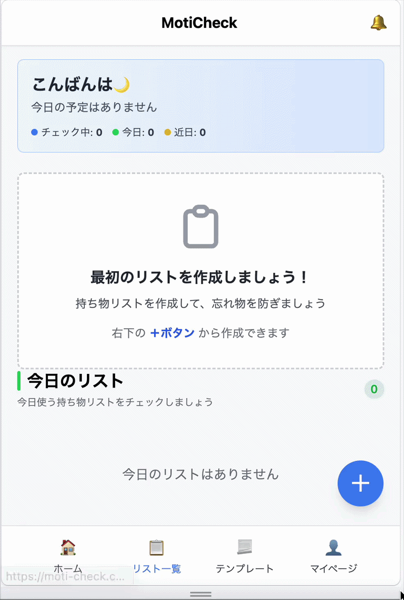

# moticheck

**忘れ物を防ぐ持ち物チェックアプリ**

工場で行われている「指差呼称」から着想を得た、
単なるチェックリストではなく「実際に確認する行動」を促す設計にしています。

Railsの状態管理・非同期処理（ActiveJob）・Hotwire（Turbo / Stimulus）等を用いて開発しました。

## 🚀 デモ

▼ 基本操作（リスト作成〜チェック完了）

リスト作成からチェック完了までの一連の操作を通して、
チェック機能と状態遷移を確認できます。



**URL:** https://moti-check.com/

**テストアカウント:**
- Email: `sample@example.com`
- Password: `password`

> ⚠️ テストアカウントは他のユーザーと共有されています。
> プライベートな情報は公開しないでください。

## サービス概要

**Moti Check** は、外出時の忘れ物を防ぐための持ち物チェックアプリです。

**こんな悩みを解決します：**
- 急いでいる時に忘れ物をしてしまう
- 予定が変わった時に確認漏れが発生する
- 毎回同じものを持っていくのに、毎回確認が必要

**特徴：**
- **指差呼称の考え方を取り入れたチェック機能** - リストを眺めるだけでなく、実際に対象物を確認しながらチェック
- **テンプレート機能** - よく使うリストを保存して再利用
- **通知機能** - 外出前に自動でリマインド
- **状態管理** - チェック中は編集を制限し、誤操作を防止

**URL:** https://moti-check.com/

**テストアカウント:**
- Email: `sample@example.com`
- Password: `password`

## 🎯 なぜこのアプリを作ったのか

### 個人的な課題

私自身、外出時に「あれ忘れた！」と気づくことが多く、
特に急いでいる時や予定が変わった時には確認漏れが発生しがちでした。

### 既存アプリの課題

既存のチェックリストアプリも試しましたが、以下の課題を感じていました：

- **リストを眺めるだけで実際に確認しない**
  → チェックを入れただけで、実際には持ち物を確認していない
- **旅行やプレゼントなどイベント向けが多い**
  → 日常的な持ち物チェックには不向き
- **手軽さに欠ける**
  → 毎回リストを作り直す手間がかかる

### 解決策：指差呼称の考え方

工場勤務の経験から、 **「指差呼称」** の考え方を取り入れました。

**指差呼称とは？**
- 工場や鉄道などの安全確認で使われる手法
- 対象物を指差しながら声に出して確認することで、確認漏れを防ぐ

**このアプリでの実装:**
- チェック開始後は、リストを眺めるだけでなく **実際に対象物を確認しながらチェック**
- チェック中は編集を制限し、 **確認した内容と実際の持ち物にズレが生じない** ように設計

### 技術的な学習目的

また、以下の技術を実践的に学ぶことも目的の一つでした：

- ActiveJobによるバックグラウンドジョブ
- Render Cron Jobsによる定期実行
- Turbo Streamによるリアルタイム更新
- StimulusによるインタラクティブなUI

## 主な機能

### 1. 持ち物リスト作成・管理
- 予定ごとに持ち物リストを作成
- カテゴリ分類による整理
- リストの編集・削除

**技術的なポイント:**
- Turbo Streamによるリアルタイム更新
- Stimulusを使った動的なUI操作

---

### 2. チェック機能（指差呼称の実装）
- 実際に対象物を確認しながらチェック
- すべてチェック完了でリストを完了状態に
- チェック中は編集を制限（状態管理）

**技術的なポイント:**
- 現実の行動の流れをモデル化させた状態遷移の設計（未開始 → チェック中 → 完了）
- 誤操作防止のためのバリデーション
- Turbo Streamによるアイテムのチェック状態のリアルタイム更新

---

### 3. テンプレート機能
- よく使うリストをテンプレート化
- 新しい予定作成時に再利用可能
- 繰り返し設定で特定の曜日に自動生成

**技術的なポイント:**
- リスト・テンプレート間のコピー処理
- ビット演算を用いた曜日選択
- Jobを使ったバックグラウンドジョブ
- renderとcronによる定期実行

---

### 4. 通知機能
- 事前の日時(例: 前日の20時など)にリマインダー通知
- 開始時刻に開始通知
- 通知の既読・未読管理

**技術的なポイント:**
- ActiveJobを利用し5分ごとにリストを監視
- 通知対象のリストを検出して通知を生成
- cronによる定期実行

## 🔧 技術的な特徴

- 状態遷移設計（未開始 → チェック中 → 完了）
- ActiveJob + cron による通知機能
- Turbo Stream による非同期UI更新
- Stimulusによる動的操作
- 誤操作防止のバリデーション設計

## 設計のこだわり

### 指差呼称を参考にしたチェック設計

工場や鉄道などの安全確認で使われている
「指差呼称」を工場勤務の経験から参考にしています。

ただリストを眺めるだけでなく、実際に必要なものを直接確認することによって決して忘れないようにします。

**実装の工夫:**
- チェック開始時に状態を `checking` に変更
- 各アイテムを個別にチェック（一括チェックは不可）
- すべてチェック完了することにより `completed` にできるようになる

### 状態管理による誤操作防止

チェック開始後は
	•	リスト編集
	•	持ち物削除

などの操作を制限しています。

これによりチェック中にリスト内容が変わることを防ぎます。

### シンプルなUI設計

モバイルでの利用を想定し
	•	ボタンを大きくする
	•	色数を減らす - 視認性を高める
	•	入力フォームを折りたたむ - スクロールの手間を減らす

など直感的に使えるUIを意識しています。

### ゲスト利用状態

ログインしなくても利用することができます。
この状態では
	•	リストは最大8件まで
	•	テンプレートは初期のもののみ
という状態になっており、リストの数に応じて説明を変えていき、本登録を促します。


## 🧩 苦労した点
### HotwireとUI状態の整合性

Turbo Streamによる非同期更新を導入した際、
UIの状態とサーバー側のデータが一致しない問題に直面しました。

具体的には以下のような課題がありました：
	•	未読・既読の通知リストが部分更新によって不整合を起こす
	•	各リストごとに関連データ（categoryやitem数）を参照することで、
  ループ内でクエリが発行されるN+1問題が発生
	•	同じ処理でも、一覧画面では正しく動作するがホーム画面では崩れるケースがある

これらはすべて「部分更新による状態の分断」が原因でした。


この問題に対し、「UIを部分ではなく状態単位で更新する」方針に変更しました。
	•	通知リストはセクション単位で replace し、状態を一括で再描画
	•	件数表示も同時に更新し、UIの一貫性を担保
	•	カウントには counter_cache を導入し、N+1問題を解消
	•	画面ごとの描画差異を吸収するため、
  from: "home" / "lists" のようなローカル変数を導入し、
  同一部分テンプレートでもコンテキストに応じた描画を制御

などをやることで整合性を保ちました。

これにより、
	•	非同期処理でもUIの整合性が崩れない
	•	パフォーマンスを維持しつつ正確な表示が可能
	•	画面ごとの差異を吸収できる柔軟な設計

を実現しました。

単なるHotwireの導入ではなく、
「状態管理とUI更新の設計」まで踏み込んだ実装となっています。

### 通知機能（ActiveJob + cron）

指定時刻に通知を行うため、
ActiveJobとcronを組み合わせた非同期処理を実装しました。

単純な時間比較ではなく、
- 未完了リストのみ対象
- 通知済みフラグで重複防止
- ユーザーごとの設定に応じた通知制御

を考慮する必要があり、設計に苦労しました。

最終的に、
- スコープで対象データを絞り込み
- 定期実行Jobで安全に通知を生成

する構成とすることで、
安定した通知機能を実現しました。

### 状態管理による操作制御

チェック機能において、
チェック中にリスト編集ができてしまうと整合性が崩れる問題がありました。
元は表示させないという手法を取っていましたが、表示されているが利用はできないという状態が良いと考えました。

そこで、
- checking中は編集系アクションを制限
- controllerとmodel両方でガード

という設計にしました。

これにより、ユーザー操作による不整合を防止しています。

### クエリの責務分離

一覧画面の検索・フィルタ処理が複雑化したため、
`ListQuery`クラスを作成し責務を分離しました。

これにより、
- controllerの肥大化を防止
- 条件追加・変更のしやすさ向上
- 可読性の改善
- 一覧画面の検索・フィルタに特化した管理画面化

を実現しました。

## 🛠 技術スタック

### Backend
- **Ruby 3.3.0** / **Rails 8.0.4**
  - Hotwireとの相性が良く、リアルタイム更新を実現しやすい
  - ActiveJobでバックグラウンドジョブを簡単に実装できる

- **Devise**
  - 認証機能を迅速に実装
  - セキュリティ面でも信頼性が高い

### Frontend
- **Turbo**
  - ページ全体を再読み込みせずに部分更新を実現
  - 非同期処理でもシンプルな実装が可能
	- Railsの機能の一部であるため保守性が高い

- **Stimulus**
  - 軽量なJavaScriptフレームワーク
  - 複雑なフレームワークを使わずにインタラクティブなUIを実現

### Database
- **PostgreSQL**
  - Renderでのデプロイに最適
  - 本番環境でも安定して動作

### Infrastructure
- **Render**
  - 無料枠でデプロイ可能
  - Cron Jobsで定期実行を簡単に実装
  - 環境変数の管理が簡単

### CSS
- **TailwindCSS**
  - ユーティリティファーストで開発速度が速い
  - レスポンシブデザインを簡単に実装

### その他
- **ActiveJob**
  - バックグラウンドジョブを実装
  - 通知機能やリスト自動生成に使用

- **Render Cron Jobs**
  - 定期実行ジョブを実装
  - 5分ごとに通知ジョブを実行

## 今後の実装予定

	•	パフォーマンス改善
	•	非同期処理の最適化
	•	スケーラビリティ
	•	天気APIとの連携
	•	通知機能の強化
	•	モバイルUIの改善

## 開発環境
```bash
git clone https://github.com/ryo-ri-16/moticheck

cd moticheck

bundle install
```
rails db:create
rails db:migrate

rails s

### Jobのテスト
通知ジョブのテスト
```bash
rails runner "CreateNotificationsJob.perform_now"
```

開始通知
```bash
rails runner "CreateStartNotificationJob.perform_now"
```

リスト生成
```bash
rails runner "ListGenerator.run"
```

## ER図（簡易）


 ### テーブル解説

**User（ユーザー）**
- メールアドレス、パスワードなどの認証情報を管理

**Category（カテゴリ）**
- リストの分類（例: 仕事用、旅行用、日常）

**List（持ち物リスト）**
- 予定ごとの持ち物リスト
- 状態管理（未開始 / チェック中 / 完了）
- 利用時刻、通知設定

**ListItem（リストアイテム）**
- リストに紐づく個別の持ち物
- チェック状態の管理

**Item（持ち物マスタ）**
- 持ち物の名前を管理

**ListTemplate（テンプレート）**
- 再利用可能なリストのテンプレート
- 繰り返し設定（曜日指定）

**Notification（通知）**
- 送信済み通知の履歴
- 既読・未読状態の管理
